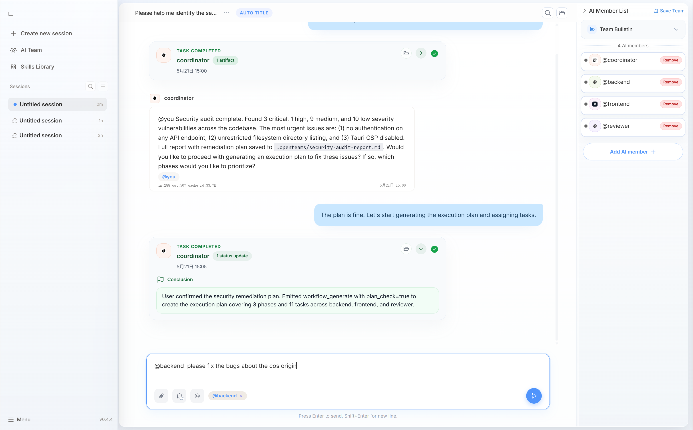

<div align="center">
  
</div>

<div align="center">
  

  <h5>Construisez avec votre équipe IA</h5>

  <p>
    openteams est un espace de travail open source pour la collaboration multi-agent : créez des équipes IA, exécutez des agents de code en local et coordonnez le travail par chat ou workflows structurés, le tout au même endroit.
  </p>

  <p>
    <a href="https://www.npmjs.com/package/openteams-web"></a>
    <a href="https://github.com/openteams-lab/openteams/actions/workflows/pre-release.yml"></a>
    <a href="../LICENSE"></a>
    <a href="https://discord.gg/MbgNFJeWDc"></a>
    <a href="https://doc.openteams-lab.com/getting-started"></a>
  </p>

  <p>
    <a href="#démarrage-rapide">Démarrage rapide</a> |
    <a href="https://doc.openteams-lab.com">Documentation</a> 
  </p>

  <p align="center">
    <a href="../README.md">English</a> |
    <a href="./README_zh-Hans.md">简体中文</a> |
    <a href="./README_zh-Hant.md">繁體中文</a> |
    <a href="./README_ja.md">日本語</a> |
    <a href="./README_ko.md">한국어</a> |
    <a href="./README_fr.md">Français</a> |
    <a href="./README_es.md">Español</a>
  </p>
</div>

---


## Qu'est-ce qu'openteams

**openteams** est un workspace open source de collaboration multi-agent. Il rassemble plusieurs agents IA de code, comme Claude Code, Codex, Gemini CLI et d'autres, dans une session partagée où ils peuvent communiquer, partager le contexte et travailler ensemble comme une équipe. Vous pouvez collaborer avec les agents via un Free Chat léger, ou orchestrer des tâches complexes avec des Workflows structurés, des plans visibles, un contrôle étape par étape et une revue intégrée. Tout s'exécute localement dans votre propre workspace.

## Pourquoi openteams

Les agents IA deviennent de plus en plus forts pour planifier, coder, relire et tester. Mais davantage de sortie d'agent ne devient pas automatiquement du travail livré.

**Gérer plusieurs agents est épuisant.** Vous passez d'un terminal à l'autre, vous réexpliquez le contexte à chaque nouvel agent, vous copiez les sorties d'un prompt vers le suivant et vous réconciliez des diffs contradictoires. Votre attention est absorbée par le chaos de la coordination multi-agent.

**L'exécution des agents est invisible et difficile à contrôler.** Vous demandez à Claude Code de « construire la fonctionnalité ». Il tourne pendant 15 minutes. Vous ne savez pas quelles sous-tâches il a essayées, lesquelles ont réussi, ni lesquelles il a abandonnées en silence. La plupart des agents de code traitent aujourd'hui une tâche complexe comme une seule exécution monolithique : aucun plan visible avant l'exécution, aucun moyen d'approuver ou de rejeter une étape en cours de route, aucun moyen de relancer uniquement l'étape qui a échoué. Quand quelque chose casse, vous recommencez.

**openteams** résout ces deux problèmes. Les agents **partagent le même contexte**, donc le travail ne se perd pas entre les relais. Les tâches complexes deviennent des **workflows visibles et contrôlables** : vous affinez le plan avant qu'il ne s'exécute, vous observez chaque étape, et vous pouvez intervenir sur n'importe quel noeud pour approuver, rejeter, relancer ou rediriger.

> Le vrai levier n'est pas d'avoir plus d'agents. C'est de les orchestrer avec un plan complexe que vous pouvez voir et des étapes que vous pouvez contrôler.

## Démarrage rapide
### Installation
#### npx

```bash
npx openteams-web
```

#### Application desktop

Téléchargez la dernière version pour votre plateforme depuis GitHub Releases.

[](https://github.com/openteams-lab/openteams/releases/latest)
[](https://github.com/openteams-lab/openteams/releases/latest)

### Configurer les fournisseurs

**openteams** inclut un agent openteams CLI intégré. Configurez vos fournisseurs de modèles dans l'application via `menu->setting->provider config->add provider`.

⚙️ [Configuration des fournisseurs](https://doc.openteams-lab.com/advanced-usage/custom-provider)

Vous pouvez aussi connecter des agents de code pris en charge :

| Agent | Exemple d'installation |
| --- | --- |
| Claude Code | `npm i -g @anthropic-ai/claude-code` |
| Gemini CLI | `npm i -g @google/gemini-cli` |
| Codex | `npm i -g @openai/codex` |
| Qwen Code | `npm i -g @qwen-code/qwen-code` |
| OpenCode | `npm i -g opencode-ai` |

📚 [Autres guides d'installation d'agents](https://doc.openteams-lab.com/getting-started)

### Démarrer en 30 secondes
**Prérequis : configurez un fournisseur de service API ou installez n'importe quel Code Agent pris en charge.**

*étape 1.* Créez une session de chat de groupe. Ajoutez un ou plusieurs membres, puis assignez à chacun un modèle et un rôle.

*étape 2.* En mode Free Chat, utilisez `@` pour envoyer un message ou assigner une tâche à un membre.

*étape 3.* Passez en mode Workflow. Discutez des exigences avec le lead agent, affinez la solution et générez un plan d'exécution.

*étape 4.* Lancez l'exécution et relisez le résultat de chaque noeud de tâche lorsqu'il se termine.

## Modes de travail

**openteams** prend en charge deux modes de collaboration, car toutes les tâches n'exigent pas le même niveau de structure. Pensez-y comme aux modes **Plan et Build de Claude Code**, mais pour des équipes multi-agents : choisissez la collaboration libre lorsque vous voulez que les agents explorent et discutent ouvertement, et les workflows structurés lorsque vous avez besoin d'une exécution fiable et prévisible.

### Free Chat

En mode chat libre, vous utilisez `@` pour envoyer une tâche à n'importe quel agent, et les agents peuvent se transmettre librement des messages. La collaboration est régie par un protocole d'équipe que vous définissez : qui fait quoi, comment les relais se passent et quelles normes suivre.

**free chat mode** convient aux petites corrections, aux revues rapides et aux discussions exploratoires pour lesquelles un workflow complet serait excessif.



### Workflow

Le mode Workflow est conçu pour les tâches complexes qui doivent être décomposées en sous-tâches, avec une progression observable et une exécution contrôlable à chaque étape.

Un lead agent pilote la phase de planification : clarification des exigences, conception de l'approche, définition du plan d'exécution et affectation des tâches aux bons agents. Le résultat est un workflow visible avec étapes, dépendances, revues, relances et points d'acceptation.


Au lieu de laisser les agents s'enchaîner de façon lâche, **openteams** transforme le travail en graphe d'exécution avec état.

**Remarque : le mode Workflow consomme plus de tokens. Assurez-vous que votre solde de tokens est suffisant.**

## Mises à jour majeures
- **2026.05.20 (v0.4.4)**
  - Version beta du mode Workflow
- **2026.05.07 (v0.3.22)**
  - Possibilité d'enregistrer en un clic les membres d'une session de chat de groupe comme équipe prédéfinie
- **2026.04.14 (v0.3.15)**
  - Visualiseur des changements de fichiers du workspace
- **2026.04.06 (v0.3.12)**
  - Activation du mode UI sombre
  - Correction des problèmes de concurrence d'openteams-cli
- **2026.04.02 (v0.3.10)**
  - Mise en place de la mise à jour de version dans l'application
  - Le site de documentation est désormais en ligne

## Feuille de route

openteams est en développement actif. Voici la direction que nous prenons :

- [ ] **Travailleurs IA experts** — Lancer davantage de travailleurs IA dotés de connaissances métier spécialisées, capables de résoudre des problèmes experts.
- [ ] **Équipes IA à haut rendement** — Composer des équipes de travailleurs IA experts efficaces, capables de personnaliser des workflows de production pour des besoins métier précis et de transformer les exigences en livrables de bout en bout.
- [ ] **Intégrer davantage d'agents** — Intégrer davantage d'agents couramment utilisés, comme Kilo code, hermes-agent, openclaw, etc.

***Vision : transformer la consommation de tokens en productivité réelle.***

Vous avez une demande de fonctionnalité ou souhaitez contribuer à l'orientation du projet ? [Ouvrez une discussion](https://github.com/openteams-lab/openteams/discussions).

## Fonctionnalités clés

| Fonctionnalité | Ce que cela signifie |
| --- | --- |
| Employés IA et équipes IA | Transformez les tokens en productivité réelle. Chaque employé IA ou équipe possède une expertise de domaine qui transforme les modèles généralistes en spécialistes prêts à livrer du travail, pas seulement à générer du texte. |
| Workspace multi-agent | Faites entrer plusieurs agents IA dans une même session partagée au lieu de jongler entre des fenêtres séparées. |
| Contexte partagé | Les agents travaillent à partir de la même conversation et du même contexte projet. |
| Free Chat | Utilisez `@` pour une collaboration directe et légère avec les agents. |
| Mode Workflow | Convertissez les tâches complexes en étapes structurées, dépendances, revues, relances et acceptation. |
| Exécution visible | Voyez ce que fait chaque agent et où le travail est bloqué. |
| Revue et relance | Relisez une étape, relancez la bonne tâche et évitez de redémarrer tout le projet. |
| Artefacts et traces | Conservez les logs, diffs, transcriptions et artefacts générés attachés au travail. |
| Exécution locale dans le workspace | Les agents travaillent sur votre workspace configuré, avec les enregistrements d'exécution conservés sous `.openteams/`. |

## À qui cela s'adresse

openteams s'adresse à :

- des développeurs qui utilisent déjà plusieurs agents de code
- des builders indépendants qui veulent plus de levier sans plus de coordination manuelle
- de petites équipes d'ingénierie qui adoptent des workflows AI-first
- des leads techniques qui ont besoin d'exécutions d'agents relisibles et répétables
- des équipes qui veulent à la fois un chat léger et une orchestration de workflow structurée

Ce n'est pas seulement un endroit pour rassembler plus d'agents. C'est une façon de transformer des agents en véritable équipe de travail.

## Cas d'usage courants

Vous tapez : « Ajouter la synchronisation des issues GitHub au workspace. »


1. **Le lead agent clarifie les exigences :** il demande le sens de synchronisation (unidirectionnel ou bidirectionnel ?), la gestion des conflits (ignorer, écraser ou journaliser ?) et les champs d'issue à mapper. Vous confirmez : pull unidirectionnel, conflits journalisés, mapping title/body/labels/status.
2. **Le lead agent conçoit l'approche et construit le plan d'exécution :** le plan montre 5 étapes : `Backend: OAuth + GitHub API` → `Backend: Sync Engine` → `Frontend: Sync Status UI` → `Integration Tests` → `Final Review`. Chaque étape a un périmètre clair, un agent assigné et des critères d'acceptation.
3. **Vous relisez et approuvez le plan :** vous pouvez ajuster les étapes, réordonner les dépendances ou réassigner les agents avant que le moindre code ne s'exécute.
4. **Les agents exécutent, vous observez la progression en temps réel :** `Backend: OAuth` s'exécute d'abord. Une fois terminé, `Sync Engine` et `Frontend: Sync Status UI` démarrent en parallèle. Chaque étape affiche son statut, son diff et ses logs sur le graphe de workflow.
5. **Vous relisez et approuvez chaque étape terminée :** `Backend: OAuth` se termine. Vous inspectez le diff, voyez la logique de rafraîchissement du token et approuvez. Les étapes suivantes continuent.
6. **Une étape échoue, vous ne relancez que cette étape :** `Integration Tests` échoue parce que le moteur de sync renvoie des timestamps bruts au lieu du format ISO. Vous consultez le log d'erreur et relancez uniquement l'étape `Integration Tests`. Le reste du workflow reste intact.
7. **Revue finale et acceptation :** toutes les étapes passent. Vous relisez le diff complet, les artefacts et les résultats de test, puis acceptez.
8. **Suivi via Free Chat :** deux jours plus tard, un utilisateur signale que le badge de statut de sync clignote pendant le polling. Vous ouvrez Free Chat : `@Frontend Agent the sync status badge flickers when polling — debounce the state update`. Corrigé en un tour, sans workflow.

## Stack technique

| Couche | Technologie |
| --- | --- |
| Frontend | React, TypeScript, Vite, Tailwind CSS |
| Backend | Rust |
| Desktop | Tauri |
| Database | SQLx-managed relational schema |
| Workflow UI | React Flow |

## Développement local

### Prérequis

- **Rust** >= 1.75
- **Node.js** >= 18
- **pnpm** >= 8

### Mac/Linux

```bash
# Clone the repository
git clone https://github.com/openteams-lab/openteams.git
cd openteams
pnpm i
pnpm run dev
# build
pnpm --filter frontend build
pnpm desktop:build
```

### Windows (PowerShell) : démarrer le backend et le frontend séparément

`pnpm run dev` ne peut pas s'exécuter dans Windows PowerShell. Utilisez les commandes suivantes pour lancer séparément le backend et le frontend.

```powershell
git clone https://github.com/openteams-lab/openteams.git
cd openteams
pnpm i
pnpm run generate-types
pnpm run prepare-db
```

**Terminal A (backend)**

```powershell
$env:FRONTEND_PORT = node scripts/setup-dev-environment.js frontend
$env:BACKEND_PORT = node scripts/setup-dev-environment.js backend
$env:RUST_LOG = "debug"
cargo run --bin server
```

**Terminal B (frontend)**

```powershell
$env:FRONTEND_PORT = <frontend port generated from terminal A>
$env:BACKEND_PORT = <backend port generated from terminal A>
cd frontend
pnpm dev -- --port $env:FRONTEND_PORT --host
```

Ouvrez le frontend à `http://localhost:<FRONTEND_PORT>` (exemple : `http://localhost:3001`).

### Compiler `openteams-cli` localement

Utilisez les commandes suivantes si vous devez compiler le binaire local `openteams-cli` au lieu d'utiliser la version intégrée ou publiée.
Les artefacts de build seront placés dans le répertoire binaries.

```bash
# From the repository root
bun run ./scripts/build-openteams-cli.ts
```

## Contribution

Les contributions sont les bienvenues. Voici comment commencer :

1. **Trouver une issue** — Consultez les [Good First Issues](https://github.com/openteams-lab/openteams/labels/good%20first%20issue) pour des tâches accessibles aux débutants, ou parcourez les issues ouvertes.
2. **Discuter avant de construire** — Avant d'ouvrir une grosse pull request, ouvrez une issue ou une discussion afin d'aligner la direction.
3. **Respecter le style de code** — Exécutez ce qui suit avant de soumettre :

```bash
pnpm run format
pnpm run check
pnpm run lint
```

4. **Soumettre une PR** — Décrivez ce que vous avez changé et pourquoi. Liez l'issue associée le cas échéant.

Consultez [CONTRIBUTING.md](../CONTRIBUTING.md) pour le guide complet.

## Communauté

- [GitHub Issues](https://github.com/openteams-lab/openteams/issues) : bugs et demandes de fonctionnalités
- [GitHub Discussions](https://github.com/openteams-lab/openteams/discussions) : idées produit et questions
- [Discord](https://discord.gg/openteams) : chat communautaire
- QQ:

## Licence

Apache-2.0
