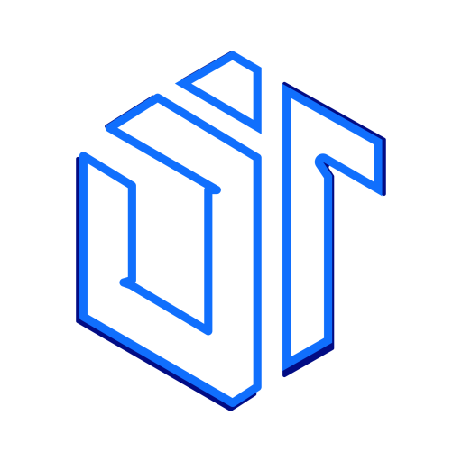
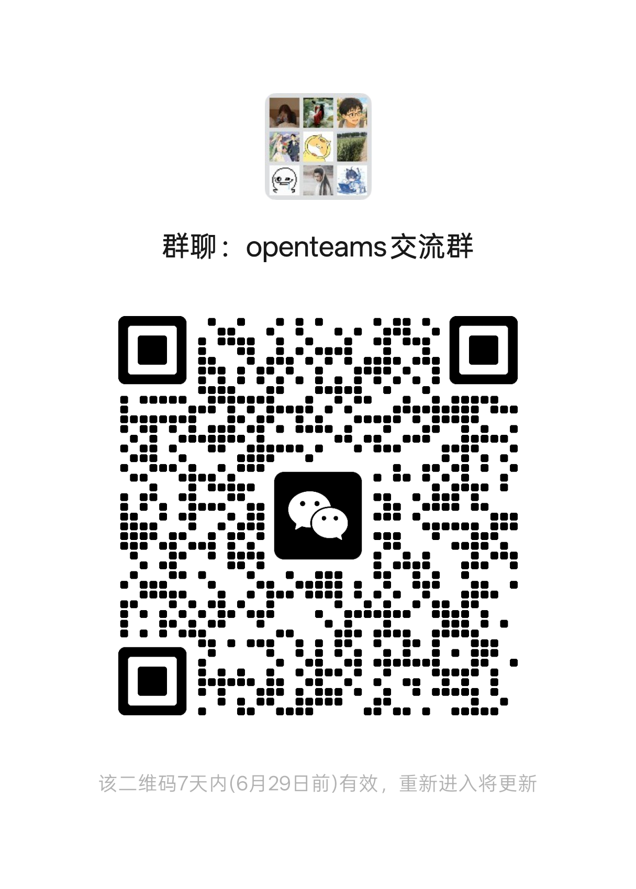

<div align="center">
  
</div>

<div align="center">
  

  <h5>계획하고, 만들고, 출시하세요 — 하나의 AI가 아니라 AI 에이전트 팀과 함께</h5>

  <p>
    여러 AI 에이전트가 하나의 컨텍스트를 공유합니다 — 채팅으로 자유롭게 협업하거나, 보고 검토하고 다시 시도할 수 있는 워크플로우로 복잡한 작업을 오케스트레이션하세요.
  </p>

  <p>
    <a href="https://www.npmjs.com/package/openteams-web"></a>
    <a href="https://github.com/openteams-lab/openteams/actions/workflows/pre-release.yml"></a>
    <a href="../LICENSE"></a>
    <a href="https://discord.gg/MbgNFJeWDc"></a>
    <a href="images/openteams-wechat-community.png"></a>
    <a href="images/openteams-feishu-community.png"></a>
    <a href="https://doc.openteams-lab.com/getting-started"></a>
  </p>

  <p>
    <a href="#빠른-시작">빠른 시작</a> |
    <a href="https://doc.openteams-lab.com">문서</a> 
  </p>

  <p align="center">
    <a href="../README.md">English</a> |
    <a href="./README_zh-Hans.md">简体中文</a> |
    <a href="./README_zh-Hant.md">繁體中文</a> |
    <a href="./README_ja.md">日本語</a> |
    <a href="./README_ko.md">한국어</a> |
    <a href="./README_fr.md">Français</a> |
    <a href="./README_es.md">Español</a>
  </p>
</div>

---
<div align="center">
  <video src="https://github.com/user-attachments/assets/f918d5c7-68ff-4a8b-b2b4-f4f0ab31c17d" controls width="100%">
    <a href="https://github.com/user-attachments/assets/f918d5c7-68ff-4a8b-b2b4-f4f0ab31c17d">제품 영상 보기</a>
  </video>
</div>

## openteams란?

**openteams**는 오픈 소스 멀티 에이전트 협업 워크스페이스입니다. Claude Code, Codex, Gemini CLI 같은 여러 AI 코딩 에이전트를 하나의 공유 세션으로 가져와 서로 소통하고, 컨텍스트를 공유하며, 팀처럼 함께 일하게 합니다. 가벼운 Free Chat으로 에이전트와 협업할 수도 있고, 보이는 계획, 단계별 제어, 내장 리뷰가 포함된 구조화된 Workflows로 복잡한 작업을 오케스트레이션할 수도 있습니다. 모든 것은 사용자의 로컬 워크스페이스에서 실행됩니다.

## 왜 openteams인가?

AI 에이전트는 계획, 코딩, 리뷰, 테스트에서 점점 더 강력해지고 있습니다. 하지만 에이전트 출력이 많아진다고 해서 그것이 자동으로 실제 출시 가능한 작업이 되는 것은 아닙니다.

**여러 에이전트를 관리하는 일은 피곤합니다.** 터미널을 오가고, 새 에이전트마다 컨텍스트를 다시 설명하고, 한 프롬프트의 출력을 다음 프롬프트로 복사하고, 서로 충돌하는 diff를 정리해야 합니다. 여러 에이전트를 동시에 다루는 혼란 속에서 집중력이 소모됩니다.

**에이전트 실행은 보이지 않고 제어하기 어렵습니다.** Claude Code에게 “이 기능을 만들어”라고 지시하면 15분 동안 실행됩니다. 그동안 어떤 하위 작업을 시도했는지, 무엇이 통과했는지, 무엇을 조용히 포기했는지 알 수 없습니다. 오늘날 대부분의 코딩 에이전트는 복잡한 작업을 하나의 거대한 실행으로 취급합니다. 실행 전 보이는 계획도 없고, 실행 중 개별 단계를 승인하거나 거절할 방법도 없으며, 실패한 단계만 다시 시도할 방법도 없습니다. 문제가 생기면 처음부터 다시 시작해야 합니다.

**openteams**는 이 두 문제를 함께 해결합니다. 에이전트가 **하나의 컨텍스트를 공유**하므로 인수인계 중 작업이 사라지지 않습니다. 복잡한 작업은 **보이고 제어 가능한 워크플로우**가 됩니다. 실행 전에 계획을 다듬고, 각 단계가 실행되는 모습을 보고, 어떤 노드에서든 승인, 거절, 재시도, 방향 전환을 할 수 있습니다.

> 진짜 레버리지는 에이전트를 더 많이 두는 것이 아니라, 보이는 복잡한 계획과 제어 가능한 단계로 에이전트를 오케스트레이션하는 것입니다.

## 일반적인 사용 사례

사용자가 “워크스페이스에 GitHub issue 동기화를 추가해줘.”라고 입력합니다.


1. **Lead agent가 요구사항을 명확히 합니다:** 동기화 방향(단방향 또는 양방향?), 충돌 처리(건너뛰기, 덮어쓰기, 로그?), 매핑할 issue 필드를 묻습니다. 사용자는 단방향 pull, 충돌 로그, title/body/labels/status 매핑을 확인합니다.
2. **Lead agent가 접근 방식을 설계하고 실행 계획을 만듭니다:** 계획에는 5개 단계가 표시됩니다. `Backend: OAuth + GitHub API` → `Backend: Sync Engine` → `Frontend: Sync Status UI` → `Integration Tests` → `Final Review`. 각 단계에는 명확한 범위, 담당 에이전트, 승인 기준이 있습니다.
3. **사용자가 계획을 검토하고 승인합니다:** 코드가 실행되기 전에 단계를 조정하고, 의존성을 재정렬하고, 에이전트를 다시 배정할 수 있습니다.
4. **에이전트가 실행되고 진행 상황을 실시간으로 봅니다:** `Backend: OAuth`가 먼저 실행됩니다. 완료되면 `Sync Engine`과 `Frontend: Sync Status UI`가 병렬로 시작됩니다. 각 단계는 워크플로우 그래프에서 상태, diff, 로그를 보여줍니다.
5. **완료된 각 단계를 검토하고 승인합니다:** `Backend: OAuth`가 끝나면 diff를 확인하고 token refresh 로직을 본 뒤 승인합니다. 다음 단계가 진행됩니다.
6. **한 단계가 실패하면 그 단계만 다시 시도합니다:** `Integration Tests`가 실패합니다. 동기화 엔진이 ISO 형식이 아니라 raw timestamp를 반환했기 때문입니다. 오류 로그를 확인하고 `Integration Tests` 단계만 다시 시도합니다. 나머지 워크플로우는 그대로 유지됩니다.
7. **최종 리뷰와 승인:** 모든 단계가 통과됩니다. 전체 diff, 아티팩트, 테스트 결과를 검토한 뒤 승인합니다.
8. **Free Chat으로 후속 처리:** 이틀 뒤 사용자가 폴링 중 동기화 상태 배지가 깜박인다고 보고합니다. Free Chat을 열어 `@Frontend Agent the sync status badge flickers when polling — debounce the state update`라고 보냅니다. 워크플로우 없이 한 번에 수정됩니다.

## 빠른 시작
### 설치
#### npx

```bash
npx openteams-web
```

#### 데스크톱 앱

GitHub Releases에서 사용 중인 플랫폼에 맞는 최신 릴리스를 다운로드하세요.

[](https://github.com/openteams-lab/openteams/releases/latest)
[](https://github.com/openteams-lab/openteams/releases/latest)

### 제공자 설정

**openteams**에는 내장 openteams CLI 에이전트가 포함되어 있습니다. 앱에서 `menu->setting->provider config->add provider`로 모델 제공자를 설정하세요.

⚙️ [제공자 설정](https://doc.openteams-lab.com/advanced-usage/custom-provider)

다음과 같은 지원 코딩 에이전트도 연결할 수 있습니다.

| Agent | 설치 예시 |
| --- | --- |
| Claude Code | `npm i -g @anthropic-ai/claude-code` |
| Gemini CLI | `npm i -g @google/gemini-cli` |
| Codex | `npm i -g @openai/codex` |
| Qwen Code | `npm i -g @qwen-code/qwen-code` |
| OpenCode | `npm i -g opencode-ai` |

📚 [더 많은 에이전트 설치 가이드](https://doc.openteams-lab.com/getting-started)

### 30초 만에 시작하기
**필수 조건: API 서비스 제공자를 설정하거나 지원되는 Code Agent 중 하나를 설치하세요.**

*step 1.* 그룹 채팅 세션을 만듭니다. 하나 이상의 멤버를 추가하고 각 멤버에 모델과 역할을 지정합니다.

*step 2.* Free Chat 모드에서 `@`로 멤버를 멘션해 메시지를 보내거나 작업을 할당합니다.

*step 3.* Workflow 모드로 전환합니다. lead agent와 요구사항을 논의하고, 해결책을 다듬고, 실행 계획을 생성합니다.

*step 4.* 실행을 시작하고 각 작업 노드가 완료될 때 결과를 검토합니다.

## 작업 모드

**openteams**는 두 가지 협업 모드를 지원합니다. 모든 작업이 같은 수준의 구조를 요구하지는 않기 때문입니다. **Claude Code의 Plan/Build 모드**를 멀티 에이전트 팀에 맞춘 것이라고 생각하면 됩니다. 에이전트가 자유롭게 탐색하고 토론하길 원하면 자유 협업을 선택하고, 신뢰할 수 있고 예측 가능한 실행이 필요하면 구조화된 워크플로우를 선택하세요.

### Free Chat

자유 채팅 모드에서는 `@`로 원하는 에이전트에게 작업을 보내고, 에이전트끼리도 자유롭게 메시지를 주고받을 수 있습니다. 협업은 사용자가 정의한 팀 프로토콜에 따라 진행됩니다. 누가 무엇을 맡는지, 어떻게 인수인계하는지, 어떤 기준을 따르는지 정할 수 있습니다.

**free chat mode**는 작은 수정, 빠른 리뷰, 전체 워크플로우를 쓰기에는 과한 탐색적 논의에 적합합니다.


### Workflow

Workflow 모드는 복잡한 작업을 하위 작업으로 나누고, 진행 상황을 관찰하며, 각 단계에서 실행을 제어해야 할 때 적합합니다.

Lead agent가 계획 단계를 이끕니다. 요구사항을 명확히 하고, 접근 방식을 설계하고, 실행 계획을 정의하며, 적절한 에이전트에게 작업을 배정합니다. 그 결과 단계, 의존성, 리뷰, 재시도, 승인 지점을 포함한 보이는 워크플로우가 만들어집니다.


에이전트를 느슨한 체인으로 실행시키는 대신, **openteams**는 작업을 상태를 가진 실행 그래프로 전환합니다.

**참고: Workflow 모드는 더 많은 token을 사용합니다. token 잔액이 충분한지 확인하세요.**

## 주요 업데이트
- **2026.05.20 (v0.4.4)**
  - Workflow 모드 beta 버전
- **2026.05.07 (v0.3.22)**
  - 그룹 채팅 세션의 멤버를 한 번의 클릭으로 프리셋 팀으로 저장 지원
- **2026.04.14 (v0.3.15)**
  - Workspace File Change Viewer
- **2026.04.06 (v0.3.12)**
  - 다크 UI 모드 활성화
  - openteams-cli 동시성 문제 수정
- **2026.04.02 (v0.3.10)**
  - 앱 내 버전 업데이트 구현
  - 문서 웹사이트 공개

## 로드맵

openteams는 활발히 개발 중입니다. 앞으로 다음 방향으로 나아갑니다.

- [ ] **전문 AI workers** — 전문 분야 지식을 갖추고 전문적인 문제를 해결할 수 있는 AI workers를 더 많이 제공합니다.
- [ ] **고산출 AI team** — 효율적인 전문 AI workers로 구성되어 특정 비즈니스에 맞게 생산 워크플로우를 커스터마이즈하고, 요구사항을 엔드투엔드로 산출물로 전환합니다.
- [ ] **더 많은 에이전트 통합** — Kilo code, hermes-agent, openclaw 등 더 많은 범용 Agent를 통합합니다.

***비전: token 소비를 실제 생산성으로 바꾸기.***

기능 요청이 있거나 방향성에 참여하고 싶다면 [토론을 열어 주세요](https://github.com/openteams-lab/openteams/discussions).

## 커뮤니티

- [GitHub Issues](https://github.com/openteams-lab/openteams/issues): 버그 리포트와 기능 요청
- [GitHub Discussions](https://github.com/openteams-lab/openteams/discussions): 제품 아이디어와 질문
- [Discord](https://discord.gg/openteams): 커뮤니티 채팅
- [Linux.do](https://linux.do): 친구 링크, 커뮤니티 교류 지원에 감사드립니다
- 커뮤니티 그룹:

<p>
  <a href="images/openteams-wechat-community.png"></a>
  <a href="images/openteams-feishu-community.png"></a>
</p>

## 핵심 기능

| 기능 | 의미 |
| --- | --- |
| AI 직원과 AI 팀 | token을 실제 생산성으로 바꿉니다. 각 AI 직원 또는 팀은 도메인 전문성을 갖고 범용 모델을 전문가로 끌어올립니다. 단순히 텍스트를 생성하는 것이 아니라 실제 작업을 낼 준비가 되어 있습니다. |
| 멀티 에이전트 워크스페이스 | 여러 AI 에이전트를 하나의 공유 세션으로 모아 별도 창을 오갈 필요를 줄입니다. |
| 공유 컨텍스트 | 에이전트는 같은 대화와 프로젝트 컨텍스트를 기반으로 작업합니다. |
| Free Chat | `@`를 사용해 직접적이고 가벼운 에이전트 협업을 할 수 있습니다. |
| Workflow 모드 | 복잡한 작업을 구조화된 단계, 의존성, 리뷰, 재시도, 승인으로 변환합니다. |
| 보이는 실행 | 각 에이전트가 무엇을 하고 있는지, 어디에서 작업이 막혔는지 볼 수 있습니다. |
| 리뷰와 재시도 | 단계를 리뷰하고 필요한 작업만 다시 시도해 전체 프로젝트 재시작을 피합니다. |
| 아티팩트와 추적 | 로그, diff, 트랜스크립트, 생성된 아티팩트를 작업에 연결해 보관합니다. |
| 로컬 워크스페이스 실행 | 에이전트는 설정된 워크스페이스에서 작업하며 실행 기록은 `.openteams/` 아래에 저장됩니다. |

## 이런 분들에게 적합합니다

openteams는 다음 사용자에게 적합합니다.

- 여러 코딩 에이전트를 사용하면서 전환과 조율에 지친 개발자
- 에이전트 실행을 검토 가능하고 재현 가능하게 관리해야 하는 기술 리드

이것은 단순히 더 많은 에이전트를 모아두는 장소가 아닙니다. 에이전트를 실제로 일하는 팀으로 바꾸는 방법입니다.

## 기술 스택

| 계층 | 기술 |
| --- | --- |
| Frontend | React, TypeScript, Vite, Tailwind CSS |
| Backend | Rust |
| Desktop | Tauri |
| Database | SQLx-managed relational schema |
| Workflow UI | React Flow |

## 로컬 개발

### 필수 조건

- **Rust** >= 1.75
- **Node.js** >= 18
- **pnpm** >= 8

### Mac/Linux

```bash
# Clone the repository
git clone https://github.com/openteams-lab/openteams.git
cd openteams
pnpm i
pnpm run dev
# build
pnpm --filter frontend build
pnpm desktop:build
```

### Windows (PowerShell): backend와 frontend를 따로 시작

`pnpm run dev`는 Windows PowerShell에서 실행할 수 없습니다. 아래 명령으로 backend와 frontend를 따로 시작하세요.

```powershell
git clone https://github.com/openteams-lab/openteams.git
cd openteams
pnpm i
pnpm run generate-types
pnpm run prepare-db
```

**Terminal A (backend)**

```powershell
$env:FRONTEND_PORT = node scripts/setup-dev-environment.js frontend
$env:BACKEND_PORT = node scripts/setup-dev-environment.js backend
$env:RUST_LOG = "debug"
cargo run --bin server
```

**Terminal B (frontend)**

```powershell
$env:FRONTEND_PORT = <frontend port generated from terminal A>
$env:BACKEND_PORT = <backend port generated from terminal A>
cd frontend
pnpm dev -- --port $env:FRONTEND_PORT --host
```

`http://localhost:<FRONTEND_PORT>`에서 frontend 페이지를 여세요(예: `http://localhost:3001`).

### 로컬에서 `openteams-cli` 빌드

내장 또는 공개 빌드 대신 로컬 `openteams-cli` 바이너리를 컴파일해야 한다면 아래 명령을 사용하세요.
빌드 산출물은 binaries 디렉터리에 생성됩니다.

```bash
# From the repository root
bun run ./scripts/build-openteams-cli.ts
```

## 기여

기여를 환영합니다. 시작 방법은 다음과 같습니다.

1. **issue 찾기** — 입문자에게 적합한 작업은 [Good First Issues](https://github.com/openteams-lab/openteams/labels/good%20first%20issue)를 확인하거나 open issue를 둘러보세요.
2. **개발 전에 논의하기** — 큰 pull request를 열기 전에 방향을 맞추기 위해 issue 또는 discussion을 열어 주세요.
3. **코드 스타일 따르기** — 제출 전에 아래를 실행하세요.

```bash
pnpm run format
pnpm run check
pnpm run lint
```

4. **PR 제출** — 무엇을 왜 변경했는지 설명하세요. 관련 issue가 있다면 링크해 주세요.

전체 가이드는 [CONTRIBUTING.md](../CONTRIBUTING.md)를 참고하세요.

## 라이선스

Apache-2.0
